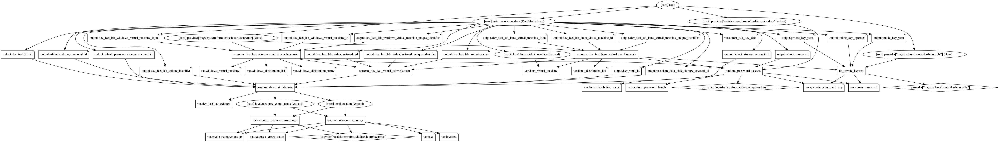

# Dev Test Labs Terraform Module

This terraform module designed to deploy Azure DevTest Labs that enables developers on teams to efficiently self-manage virtual machines (VMs) and PaaS resources without waiting for approvals. DevTest Labs creates labs consisting of pre-configured bases.

## Module Usage

```hcl
module "dev-test-lab" {
  source  = "kumarvna/dev-test-lab/azurerm"
  version = "1.0.0"

  # By default, this module will create a resource group
  # proivde a name to use an existing resource group and set the argument 
  # to `create_resource_group = false` if you want to existing resoruce group. 
  # If you use existing resrouce group location will be the same as existing RG.
  resource_group_name = "rg-shared-westeurope-02"
  location            = "westeurope"

  # Dev Test Labs specification
  dev_test_lab_settings = {
    name                            = "mydemoproject1"
    storage_type                    = "Premium"
    use_public_ip_address           = "Allow"
    use_in_virtual_machine_creation = "Allow"
  }

  # This module support multiple Pre-Defined Windows Distributions.
  # Windows Images: windows2012r2dc, windows2016dc, windows2019dc, windows2016dccore
  # MSSQL 2017 images: mssql2017exp, mssql2017dev, mssql2017std, mssql2017ent
  # MSSQL 2019 images: mssql2019dev, mssql2019std, mssql2019ent
  # To use  Gallery Image, specify `gallery_image_reference` block 
  windows_virtual_machine = {
    win2019vm1 = {
      windows_distribution_name  = "windows2019dc"
      virtual_machine_size       = "Standard_A2_v2"
      admin_username             = "azureadmin"
      storage_type               = "Premium"
      disallow_public_ip_address = false
    },
    windesktop10vm1 = {
      virtual_machine_size       = "Standard_A2_v2"
      admin_username             = "azureadmin"
      storage_type               = "Premium"
      disallow_public_ip_address = false
      gallery_image_reference = {
        publisher = "MicrosoftWindowsDesktop"
        offer     = "Windows-10"
        sku       = "20h2-ent"
        version   = "latest"
      }
    }
  }

  # This module support multiple Pre-Defined Linux Distributions.
  # Linux images: ubuntu1804, ubuntu1604, centos75, centos77, centos81, coreos
  # MSSQL 2019 Linux OS Images:
  # RHEL8 images: mssql2019ent-rhel8, mssql2019std-rhel8, mssql2019dev-rhel8
  # Ubuntu images: mssql2019ent-ubuntu1804, mssql2019std-ubuntu1804, mssql2019dev-ubuntu1804
  # To use  Gallery Image, specify `gallery_image_reference` block 
  linux_virtual_machine = {
    vm-linux = {
      linux_distribution_name    = "ubuntu1804"
      virtual_machine_size       = "Standard_A2_v2"
      admin_username             = "azureadmin"
      storage_type               = "Premium"
      disallow_public_ip_address = false
    },
    vm-linux2 = {
      virtual_machine_size       = "Standard_A4_v2"
      admin_username             = "azureadmin"
      storage_type               = "Premium"
      disallow_public_ip_address = true
      gallery_image_reference = {
        publisher = "RedHat"
        offer     = "RHEL"
        sku       = "8"
        version   = "latest"
      }
    },
  }

  # Generates a secure private key for Linux Servers - Recomended for Test VM's only.
  # By default this module generates ssh key pair for linux servers. 
  # To specify custom password, set `generate_admin_ssh_key = false` and set  `admin_password`
  # To specify own ssh key, use `admin_ssh_key_data` argument with valid key file path. 
  generate_admin_ssh_key = true
  #  admin_password         = "P@$$w0rd@1234!"

  # Adding TAG's to your Azure resources
  tags = {
    Terraform   = "true"
    Environment = "dev"
    Owner       = "test-user"
  }
}
```

## Default Local Administrator and the Password

This module utilizes __`azureadmin`__ as a local administrator on virtual machines. If you want to you use custom username, then specify the same by setting up the argument **`admin_username`** with a valid user string.

By default, this module generates a strong password for all virtual machines also allows you to change the length of the random password (currently 24) using the **`random_password_length = 32`** variable. If you want to set the custom password, specify the argument **`admin_password`** with a valid string.

This module also generates SSH2 Key pair for Linux servers by default, however, it is only recommended to use for dev environment. For production environments, please generate your own SSH2 key with a passphrase and input the key by providing the path to the argument **`admin_ssh_key_data`**.

## Pre-Defined Windows and Linux VM Images

There are pre-defined Windows or Linux images available to deploy by setting up the argument `linux_distribution_name` or `windows_distribution_name` with this module.

OS type |Available Pre-defined Images|
--------|----------------------------|
Linux |`ubuntu1804`, `ubuntu1604`, `centos75`, `centos77`, `centos81`, `coreos`
Windows|`windows2012r2dc`, `windows2016dc`, `windows2019dc`, `windows2016dccore`
MS SQL 2017|`mssql2017exp`, `mssql2017dev`, `mssql2017std`, `mssql2017ent`
MS SQL 2019|`mssql2019dev`, `mssql2019std`, `mssql2019ent`
MS SQL 2019 Linux (RHEL8)|`mssql2019ent-rhel8`, `mssql2019std-rhel8`, `mssql2019dev-rhel8`
MS SQL 2019 Linux (Ubuntu)|`mssql2019ent-ubuntu1804`, `mssql2019std-ubuntu1804`, `mssql2019dev-ubuntu1804`

## **`gallery_image_reference`** - Gallery images

If the pre-defined Windows or Linux variants are not sufficient then, you can specify the custom image by setting up the argument `gallery_image_reference` with appropriate values. Custom images can be used to bootstrap configurations such as preloading applications, application configurations, and other OS configurations.

```hcl
module "dev-test-lab" {
  source  = "kumarvna/dev-test-lab/azurerm"
  version = "1.0.0"

  # .... omitted

  # This module support multiple Pre-Defined Windows Distributions.
  # Windows Images: windows2012r2dc, windows2016dc, windows2019dc, windows2016dccore
  # MSSQL 2017 images: mssql2017exp, mssql2017dev, mssql2017std, mssql2017ent
  # MSSQL 2019 images: mssql2019dev, mssql2019std, mssql2019ent
  # To use  Gallery Image, specify `gallery_image_reference` block 
  windows_virtual_machine = {
    windesktop10vm1 = {
      virtual_machine_size       = "Standard_A2_v2"
      admin_username             = "azureadmin"
      storage_type               = "Premium"
      disallow_public_ip_address = false
      gallery_image_reference = {
        publisher = "MicrosoftWindowsDesktop"
        offer     = "Windows-10"
        sku       = "20h2-ent"
        version   = "latest"
      }
    }
  },

  # .... omitted
}
```

## Requirements

| Name | Version |
|------|---------|
| terraform | >= 0.13 |
| azurerm | >= 2.59.0 |

## Providers

| Name | Version |
|------|---------|
| azurerm | >= 2.59.0 |
| random | >=3.1.0 |
| tls | >=3.1.0 |

## Inputs

Name | Description | Type | Default
---- | ----------- | ---- | -------
`create_resource_group`|Whether to create resource group and use it for all networking resources|string|`true`
`resource_group_name` | The name of the resource group in which resources are created | string | `""`
`location`|The location of the resource group in which resources are created|string | `""`
`dev_test_lab_settings`|Specifies the arguments for dev test lab creation|object({})|`{}`
`random_password_length`|The desired length of random password created by this module|number|`24`
`linux_virtual_machine`|Manages a Linux Virtual Machine within a Dev Test Lab|map(object({}))| `null`
`windows_virtual_machine`|Manages a Windows Virtual Machine within a Dev Test Lab|map(object({}))| `null`
`generate_admin_ssh_key`|Generates a secure private key and encodes it as PEM|string|`true`
`admin_ssh_key_data`|specify the path to the existing SSH key to authenticate Linux virtual machine| string| `""`
`admin_password`|The Password which should be used for the local-administrator on this Virtual Machine|string|`null`
`linux_distribution_list`|Pre-defined Azure Linux VM images list|map(object)|`ubuntu1804`
`linux_distribution_name`|Variable to pick an OS flavor for Linux based Virtual Machine. Possible values are `centos81`, `centos77`, `centos77`, `ubuntu1804`, `ubuntu1604`, `coreos`, `mssql2019ent-rhel8`, `mssql2019std-rhel8`, `mssql2019dev-rhel8`, `mssql2019ent-ubuntu1804`, `mssql2019std-ubuntu1804`, `mssql2019dev-ubuntu1804`|string|`ubuntu1804`
`windows_distribution_list`|Pre-defined Azure Windows VM images list|map(object)|`"windows2019dc"`
`windows_distribution_name`|Variable to pick an OS flavor for Windows based VM. Possible values are `windows2012r2dc`, `windows2016dc`, `windows2019dc`, `windows2016dccore`, `mssql2017exp`, `mssql2017dev`, `mssql2017std`, `mssql2017ent`, `mssql2019dev`, `mssql2019std`, `mssql2019ent`, `mssql2019ent-byol`, `mssql2019std-byol`|string|`"windows2019dc"`
`Tags`|A map of tags to add to all resources|map|`{}`

## Outputs

|Name | Description|
|---- | -----------|
`dev_test_lab_id`|The resource ID of the Dev Test Lab
`artifacts_storage_account_id`|The ID of the Storage Account used for Artifact Storage
`default_storage_account_id`|The ID of the Default Storage Account for this Dev Test Lab
`default_premium_storage_account_id`|The ID of the Default Premium Storage Account for this Dev Test Lab
`key_vault_id`|The ID of the Key used for this Dev Test Lab
`premium_data_disk_storage_account_id`|The ID of the Storage Account used for Storage of Premium Data Disk
`dev_test_lab_unique_identifier`|The unique immutable identifier of the Dev Test Lab
`dev_test_lab_virtual_network_id`|The ID of the Dev Test Virtual Network
`dev_test_lab_subnet_name`|The name of the Subnet for this Virtual Network
`dev_test_lab_virtual_network_unique_identifier`|The unique immutable identifier of the Dev Test Virtual Network
`private_key_pem`|The private key data in PEM format
`public_key_pem`|The public key data in PEM format
`public_key_openssh`|The public key data in OpenSSH `authorized_keys` format, if the selected private key format is compatible. All RSA keys are supported, and `ECDSA` keys with curves `P256`, `P384` and `P521` are supported. This attribute is empty if an incompatible ECDSA curve is selected
`admin_password`|The Password associated with the `admin_username` used to login to this Virtual Machine
`dev_test_lab_linux_virtual_machine_id`|The ID of the Virtual Machine
`dev_test_lab_linux_virtual_machine_fqdn`|The FQDN of the Virtual Machine
`dev_test_lab_linux_virtual_machine_unique_identifier`|The unique immutable identifier of the Virtual Machine
`dev_test_lab_windows_virtual_machine_id`|The ID of the Windows Virtual Machine
`dev_test_lab_windows_virtual_machine_fqdn`|The FQDN of the Windows Virtual Machine
`dev_test_lab_windows_virtual_machine_unique_identifier`|The unique immutable identifier of the Windows Virtual Machine

## Resource Graph



## Authors

Originally created by [Kumaraswamy Vithanala](mailto:kumarvna@gmail.com).

## Other resources

* [Dev Test Labs](https://docs.microsoft.com/en-us/azure/devtest-labs/)
* [Windows Virtual Machine](https://docs.microsoft.com/en-us/azure/virtual-machines/windows/)
* [Linux Virtual Machine](https://docs.microsoft.com/en-us/azure/virtual-machines/linux/)
* [Linux VM running SQL Server](https://docs.microsoft.com/en-us/azure/azure-sql/virtual-machines/linux/sql-vm-create-portal-quickstart)
* [Windows VM running SQL Server](https://docs.microsoft.com/en-us/azure/azure-sql/virtual-machines/windows/sql-vm-create-portal-quickstart)
* [Terraform AzureRM Provider Documentation](https://www.terraform.io/docs/providers/azurerm/index.html)
